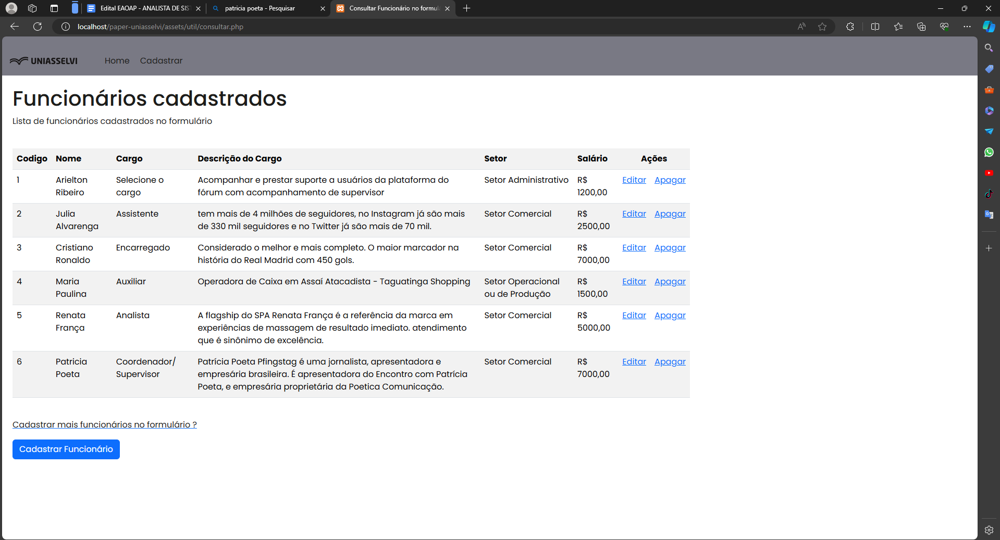
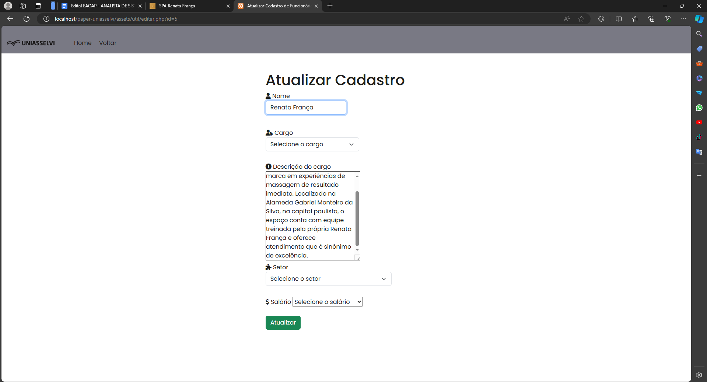

 Criar um banco de dados chamado "uniasselvi" no MySQL;
 criar as tabela com nome "funcionario";
 idfuncionario pk int,
 nome,
 cargo, 
 descricao_do_cargo, 
 setor, 
 salario;
 * TODO fazer o banco de dados pelo mysql

* TODO - Verificar algumas informações por este link [Manipulando dados com radio-button-com-php](http://devfuria.com.br/php/manipulando-radio-button-com-php/)

# Cargos em uma empresa
- Estagiário 
- Auxiliar
- Assistente
- Técnico 
- Trainee 
- Analista 
- Encarregado 
- Coordenador/ Supervisor 
- Gerente 
- Diretor
- Presidente 

# Setores de cargo em uma empresa 
- Setor Administrativo
- Setor Financeiro
- Setor de Recursos Humanos (RH)
- Setor Comercial
- Setor Operacional ou de Produção
- Setor de Tecnologias da Informação (TI)

Estagiário: Os estagiários recebem uma bolsa-auxílio de R$ 900 por mês.
Auxiliar: O salário de um auxiliar R$ 1.200 a R$ 2.000 mensais.
Assistente: Para assistentes, o salário R$ 1.500.
Técnico: O salário para técnicos de R$ 2.000 mensais.
Trainee: Trainees recebem um salário de um R$ 2.500.
Analista: Analistas um salário de R$ 3.000.
Encarregado: Encarregados ganham em média de R$ 3.500 por mês.
Coordenador/Supervisor: Coordenadores e supervisores têm responsabilidades maiores e, portanto, seus salários também são de R$ 4.000.
Gerente: Gerentes têm uma faixa salarial de R$ 5.000 por mês.
Diretor: Diretores ocupam cargos de alto escalão e, portanto, seus salários são de R$ 10.000 mensais.
Presidente: O presidente de uma empresa é o cargo mais alto e, portanto, seus salários são de R$ 20.000.

.png)

## Informações para voce criar o seu banco de dados

CREATE SCHEMA `uniasselvi` DEFAULT CHARACTER SET utf8 COLLATE utf8_unicode_ci ;

CREATE TABLE `uniasselvi`.`funcionario` (
  `idfuncionario` INT NOT NULL AUTO_INCREMENT,
  `nome` VARCHAR(45) NULL,
  `cargo` VARCHAR(45) NULL,
  `descricao_do_cargo` VARCHAR(255) NULL,
  `setor` VARCHAR(45) NULL,
  `salario` VARCHAR(20) NULL,
  PRIMARY KEY (`idfuncionario`));

## Ao final de tudo, seu app funcionará, mas com erro na senha do banco de dados dos arquivos: 
- conexao.php (/util/conexao.php). Coloque a senha do seu banco de dados, se houver
- insert_cadastro.php (/util/insert_cadastro.php). Coloque a também do seu banco de dados, se houver.
